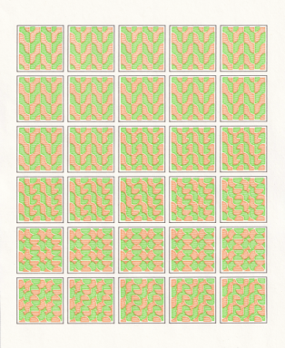

## Framomatic

convert sheets          | → | animation frames
:----------------------:|:-:|:-----------------------:
   |   | 

This is an *interactive* application for turning images containing a grid of animation frames (i.e., a "contact sheet" or "contact print") into individual cropped images per frame. You can export the result as a zip of images that can subsequently be converted into a movie format (e.g., using [ffmpeg](https://superuser.com/a/1462082)).

### How it works

The user provides these inputs:

1. Grid dimensions (number of rows and columns of the contact sheets)
2. A bounding box of the first frame
3. A bounding box of the upper left 2x2 frames

The method uses these items to iteratively guess where the next frame is. An initial guess is made using the expected spacing between frames (via item 3.) and grid dimensions. The guess is fine-tuned by using template matching where the previous frames are used as the template.

### Why did I make this

I built this app because I like to create animations designed digitally that I print to paper using a pen plotter or an inkjet printer.

To convert the printed sheets back to a movie format, I would need to scan the sheet, and then crop each frame manually, taking care to center the frame exactly, remember where I'm at in the grid, and name the cropped image correctly when I save the cropped version. In other words, it was an error-prone, tedious mess. So here we are.

### Limitations

Building automation as a web app has some drawback, however. For example, it doesn't do well with very large images or if you have many contact sheets. This could be circumvented by implementing this algorithm as a desktop processing script. But the browser enables building nice UIs rather easily.

### Contributing

Contributions welcome through pull requests, and any bugs reported as issues are highly welcome. This app was built in my free time to address a niche problem in a hobby. Please be understanding of that :)

### Tech stack

The UI is built on nextjs, react, and mantine. The image processing uses opencv-js. 
